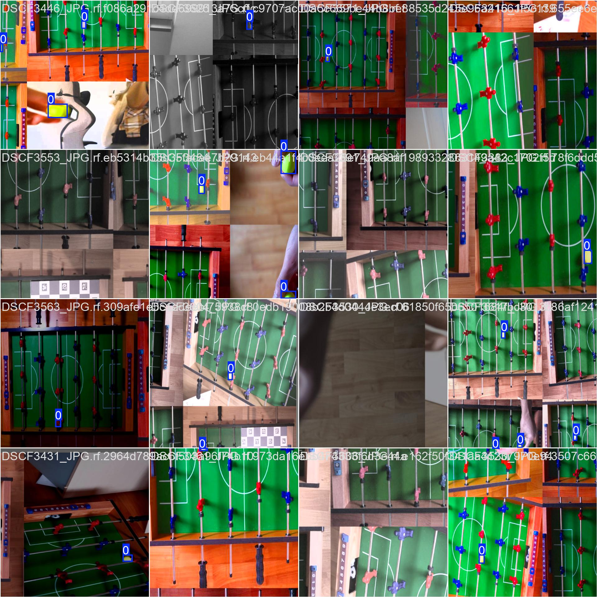
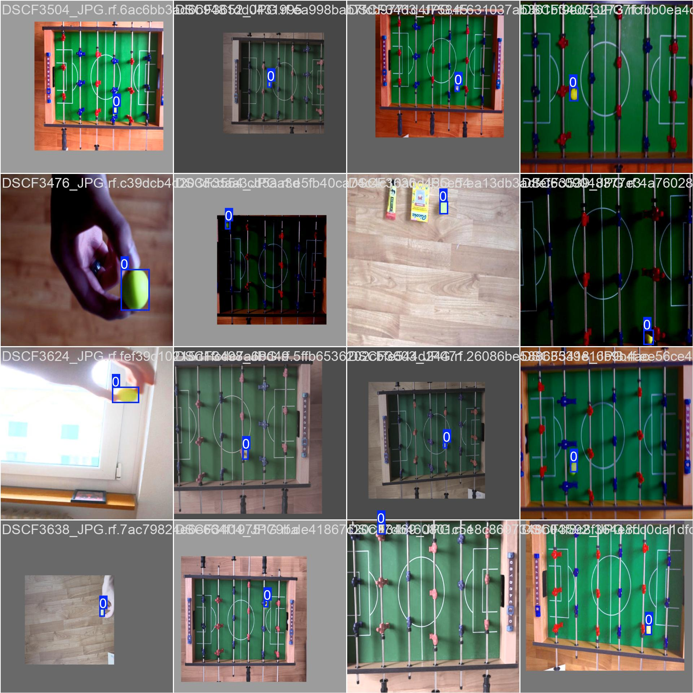

# FoosballVision

## Overview
This project focuses on developing an automated foosball table using advanced computer vision techniques and motor control. By leveraging YOLO (You Only Look Once) for ball detection and shot prediction, along with NEMA17 stepper motors for mechanical movement, we aim to create a fully automated foosball experience with precise player movement and real-time ball tracking.

## Key Features

This repository includes:

- **Custom YOLO Model**: Code for training and building a YOLO model for tracking the ball during gameplay.

- **Ball Tracking & Prediction**: Real-time ball tracking and shot prediction using computer vision.

- **Court Detection**: Detects the foosball table boundaries using OpenCV techniques like morphology and color detection.

- **Motor Control**: Code to control NEMA17 stepper motors for moving the foosball rods based on ball position and predicted trajectory.

## YOLO for Ball Tracking

We use the latest YOLO version (v11) for tracking the ball in real-time. YOLO's speed and accuracy make it an ideal choice for detecting fast-moving objects, ensuring smooth and responsive gameplay.

For more details about YOLO / Ultralytics, please visit the official [ultralytics](https://docs.ultralytics.com/modes/).


---
# Installation

## Camera Calibration

1. Run the `charuco_calibration.py` script to create a custom A4 Charuco board:
   ```bash
   python3 charuco_calibration.py
    ```
2. Take a picture of the Charuco board in your environment and save it in the `data/raw/calibration` folder.

3. Next, run the `camera_calibration.py` script to finish the calibration:
   ```bash
   python3 camera_calibration.py
   ```
4. The script will output the camera matrix and distortion coefficients, which you can use for undistorting images.

**Note**:
   More information can be found on this page: [Camera Calibration](https://medium.com/@nflorent7/a-comprehensive-guide-to-camera-calibration-using-charuco-boards-and-opencv-for-perspective-9a0fa71ada5f).
---
## YOLO Training

I used Google Colab for training the YOLO model. The training script is available in the `script/train_yolo.ipynb` notebook. You can run the notebook in Google Colab to train the model on your custom dataset.

This is how the results look like after training the model: 

<table>
  <tr>
    <td></td>
    <td></td>
  </tr>
</table>

---


### Run Ball Tracker 


---

# Run the Arduino Motor Simulation

To run the simulation, you need to use Visual Studio Code (VSCode). Follow the steps below to guide you through the process:

For a detailed video tutorial, visit: [Run Wokwi on VSCode](https://www.youtube.com/watch?v=9pTZL934k2s).

### Steps:
1. **Install Extensions:**
   - Install the **PlatformIO** and **Wokwi Simulator** extensions in VSCode.

2. **Open PlatformIO:**
   - Click on the **PlatformIO** icon in VSCode.

3. **Open the Project:**
   - Open the `motor_controller` folder within PlatformIO in VSCode.

4. **Run the Simulation:**
   - Navigate to `main.cpp` and click on the **Run on Wokwi** button.

5. **View the Simulation:**
   - Open `diagram.json` to view the simulation.

---

### How to upload and download large files to the repository

To add large files to the repository, use git lfs. To install git lfs, run the following commands:
```bash
brew install git-lfs
```
Then, go to the repository and run:
```bash
git lfs install
```
Every file you upload is tracked by git lfs.


## Credits
Software developed by [Sy Viet Dao](https://github.com/Azuki04).  
_Completed in October 2024._

